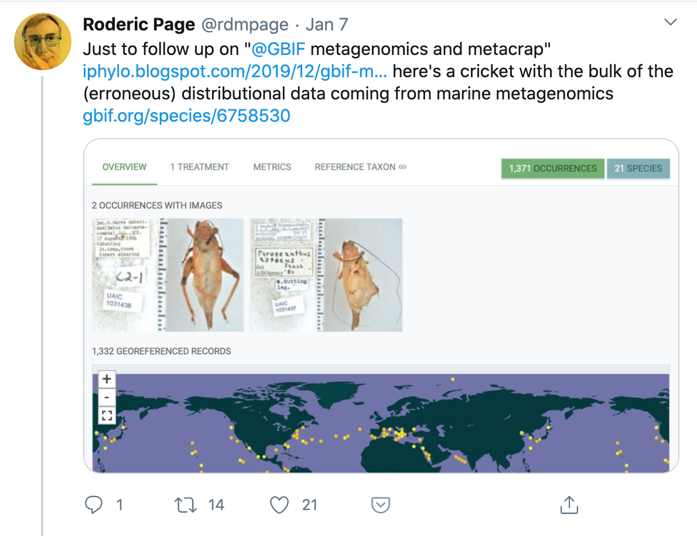
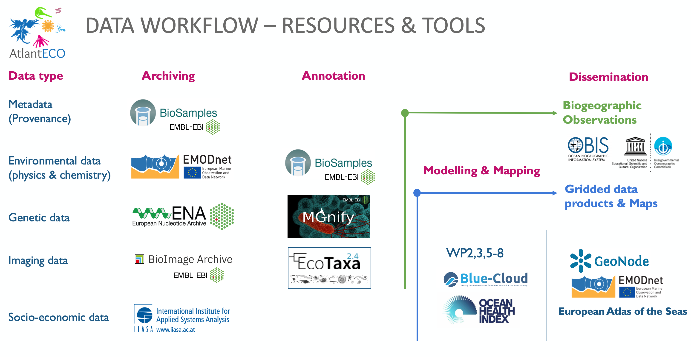
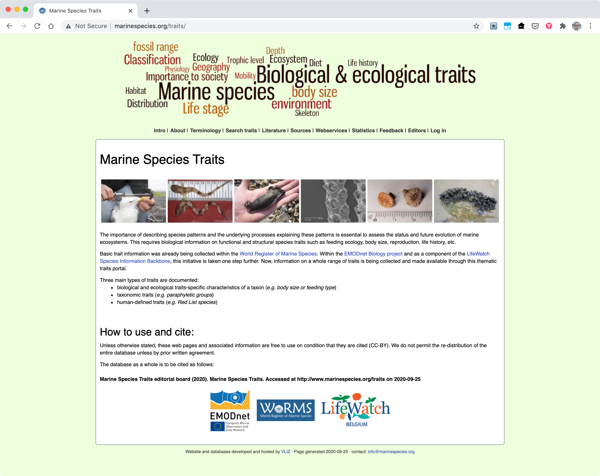
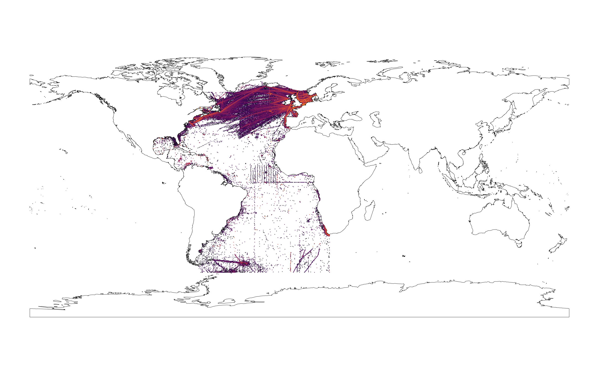

## The OBIS data pipeline

---

## Data standards and formats

- Darwin Core Archives: EML metadata + Darwin Core tabular data files
- support for event based datasets
- support for generic measurements or facts linked to vocabularies (type, value and unit)

{ width=70% }

--- 

## Quality control

- quality control at the provider and node level using community contributed tools and services (LifeWatch, EMODnet)
- internal quality control: https://github.com/iobis/obis-qc
- will be aligned with work of the TDWG Data Quality Interest Group
- no specific quality control for metagenomic data yet

{ width=50% }

--- 

## OBIS API

- documentation at https://api.obis.org
- features
  - occurrence data
    - including measurements and facts
    - including quality flags
    - filter on time, location, depth, taxonomy, and many more
  - dataset metadata
  - gridded occurrence layers (GeoJSON, vector tiles)
  - checklists
  - statistics

--- 

## R package

- provides a more friendly way to interact with the OBIS API
- available from https://github.com/iobis/robis as well as CRAN

---

---

---

## Mapper

--- 

## Gridded data products?

- not at the moment, but a GeoNode installation is coming soon
- R notebooks published to GitHub

---

## Data workflow

---

---

## Current data holdings

{ width=70% }

---

- 7,916,538 records
- 972 datasets
- 7,051 taxa

---

- 3,719,808 records
- 483 datasets
- 4,287 taxa

---

- 0 - 10 m depth: 83%
- 10 - 200 m depth: 13%
- shelf: 55%

{ width=75% }

---

| records | dataset |
| --- | --- |
| 1,517,869 | The CPR Survey |
| 333,504 | Network Monitoring phytoplankton (REPHY) |
| 253,783 | World Ocean Database 2009 |
| 222,973 | Dutch long term monitoring of phytoplankton in the Dutch Continental Economical Zone of the North Sea |
| 114,109 | ICES Historical Plankton Dataset |
| 109,287 | Atlantic Zone Monitoring Program (AZMP) DFO Quebec region phytoplankton |
| 74,084 | SHARK - Marine phytoplankton monitoring in Sweden since 1983 |
| 69,689 | Biogeographic data from BODC - British Oceanographic Data Centre |
| 67,021 | BioChem: Atlantic Zone Monitoring Program (AZMP) Quebec Region zooplankton collection |
| 62,230 | Marine and Coastal Management - Copepod Surveys (South Africa) |
| 47,207 | Continuous Plankton Recorder Dataset (NOAA) - Zooplankton |

---

---

`r emo::ji("whale")`

https://iobis.github.io/presentation-atlanteco-kickoff